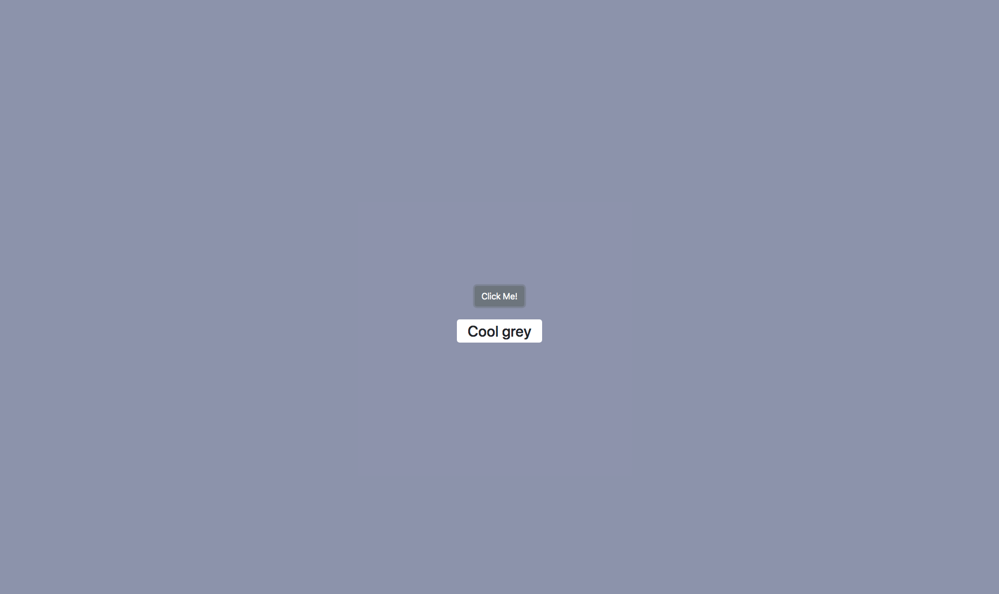

# Background Color Changer
> This is a simple project that changes the backgound color of the page and returns the name of the color.

## Demo
Here's a working live demo of the project: https://julianehiem.github.io/background-color-changer/

## Tech/framework used
* [HTML](https://developer.mozilla.org/en-US/docs/Web/HTML)
* [CSS](https://developer.mozilla.org/en-US/docs/Web/CSS)
* [JS](https://developer.mozilla.org/en-US/docs/Web/JavaScript)

## Features
In additional to the foundational HTML, CSS and JS in this project, I also made use of a simple AJAX request to a local folder.

## Links
- This project was inspired by https://jsbeginners.com/change-background-color-project/
- Repository:https://github.com/JulianEhiem/background-color-changer/

## License

This project is licensed under the terms of the **MIT** license.

MIT © [JulianEhiem](https://github.com/JulianEhiem)
